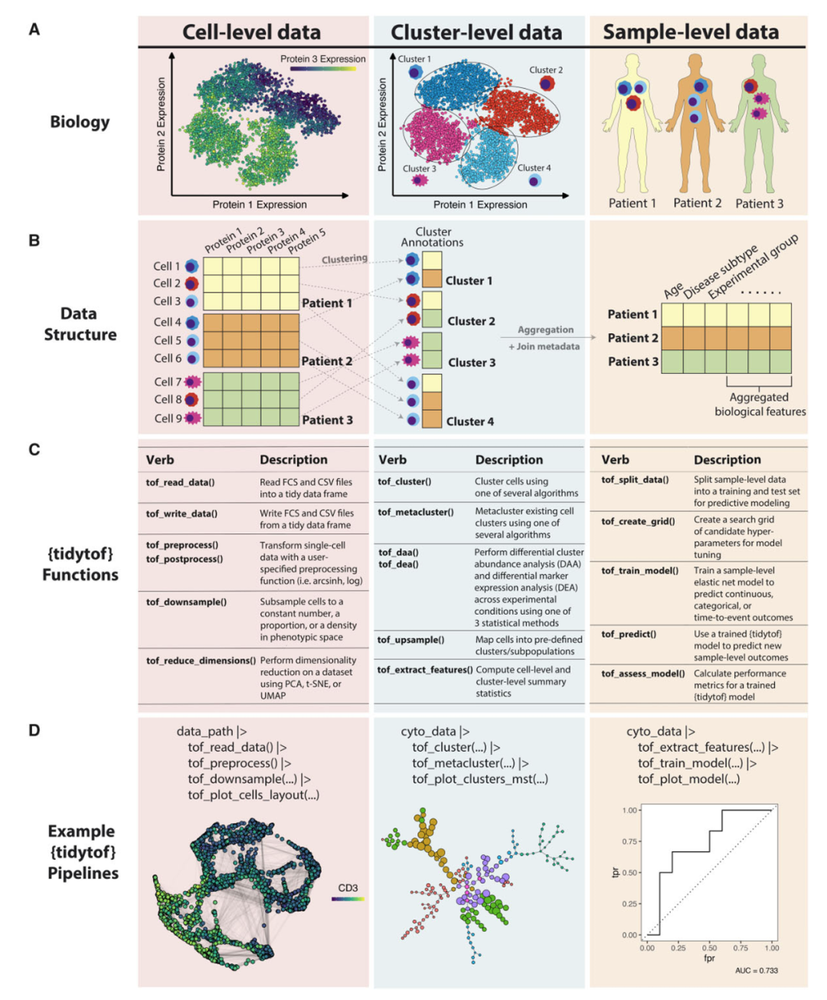

依赖于tidyverse风格的组学数据处理软件越来越多了！期待我们的tidymicrobiome！

# tidytof:一种可扩展和可重现的高维细胞数据分析的整洁框架

## 摘要

尽管已经开发出许多分析高维细胞数据的算法,但这些算法的软件实现仍然高度定制化——这意味着探索一个数据集需要用户学习每个数据处理步骤所需的独特的、互操作性差的软件语法。为解决这个问题,我们开发了tidytof,一个开源的R软件包,用于使用越来越受欢迎的“整洁数据”接口分析高维细胞数据。

## 可获得性和实现

tidytof可在https://github.com/keyes-timothy/tidytof获得,基于MIT许可证发布。它支持Linux、Windows和MacOS。额外的文档可在软件包网站上获得(https://keyes-timothy.github.io/tidytof/)。

## 引言

在过去的十年中,高维细胞技术已经成为高通量单细胞分析人类和动物组织的突出技术。基于时间飞行的质谱细胞学(或细胞质谱)、全谱流式细胞技术和序列基础的细胞技术现在已经实现了每次实验从数百万个细胞中收集多重蛋白质测量的大数据集。为从这些复杂的数据集中洞察信息,最近几年也见证了几十种用于单细胞、细胞亚群和整体样本水平分析高维细胞数据的算法的开发。然而,遍历这些方法的选择、使用和互操作性需求仍然是一个重大挑战。

在同一时间内,“整洁数据”的概念已经构成了数据科学领域的范式转变。整洁数据指的是以灵活的二维表格(称为数据帧)表示的数据,其中每一行表示一个观察,每一列表示一个实验变量。数据整洁性的核心概念是将数据表示为一致的整洁格式可以简化数据处理,方法是标准化构建分析流程所需的工具。采用整洁数据实践通常鼓励在统计软件工程中使用直观的以人为中心的设计原则,允许研究人员通过使用一致的词汇表达常见的数据处理操作,在工具和研究领域之间应用类似的分析框架。

这里,我们在之前的工作基础上,提出tidytof,一个R软件包,使用整洁接口实现全面、高效和可扩展的高维细胞数据分析框架。tidytof的综合文档和教程在补充注释和软件包注释中提供。

## 软件设计

tidytof将热门的高维细胞数据分析方法进行了整合,如文件读取、预处理、批效应校正、质量控制、聚类、降维、差异表达分析、特征提取和可视化,变成一个可组合的、易于使用的应用程序接口,适合有经验和无经验的程序员。

它的设计策略有三个主要好处:1)它允许tidytof简化访问以不同方式执行相同基本任务的算法的方式;2) tidytof动词的模块化设计意味着它们可以组合起来对单细胞数据进行灵活的分析;3) 作为高性能整洁生态系统工具的扩展,tidytof提供了相对于现有的单细胞数据分析软件的卓越的计算性能。

## 性能基准测试

我们使用等价的工作流程对tidytof的速度和内存性能进行了基准测试,并与具有类似功能的两个低级API(基本R和flowCore)以及三个高级API(cytofkit、immunoCluster和Spectre)进行了比较。结果显示,tidytof的计算性能与现有工具相当或优于现有工具,而且tidytof的总时间是基准测试中使用的所有数据集中最小的。

## 结论

总之,tidytof为使用简单的API和与许多现有的数据科学和生物信息学社区创建的工具无缝集成来分析高维细胞数据提供了一个整洁的接口。通过这种方式,tidytof降低了将标准工具应用于高维细胞数据集的编码负担,从而提高了高级分析方法对编程经验有限的研究人员的可访问性。
