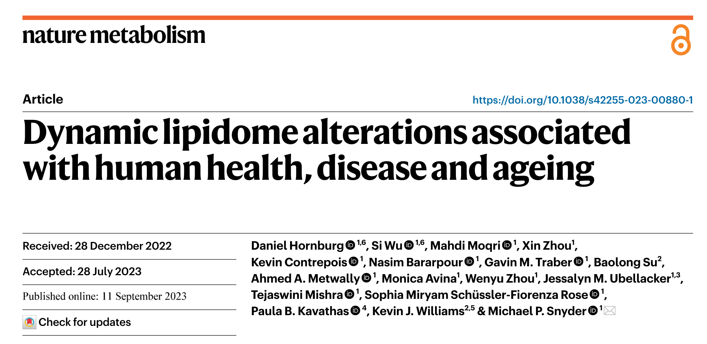
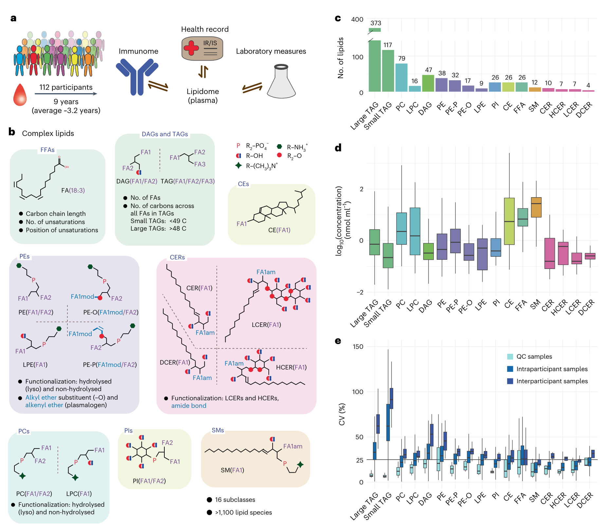
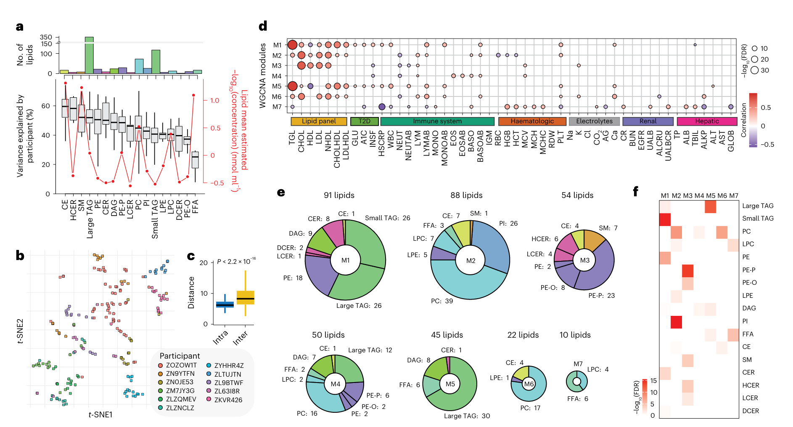
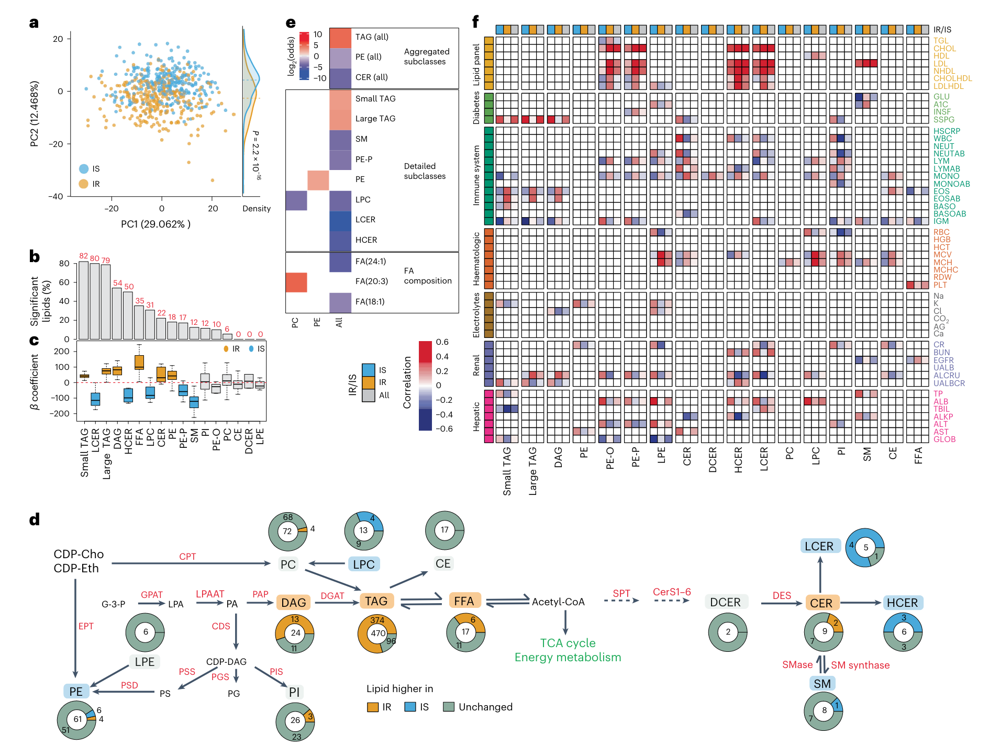
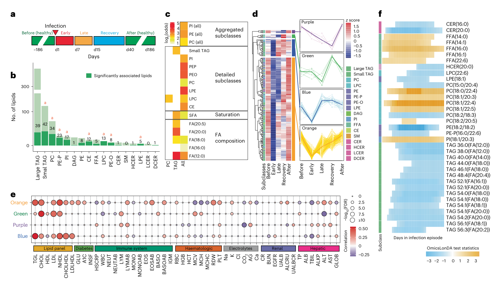
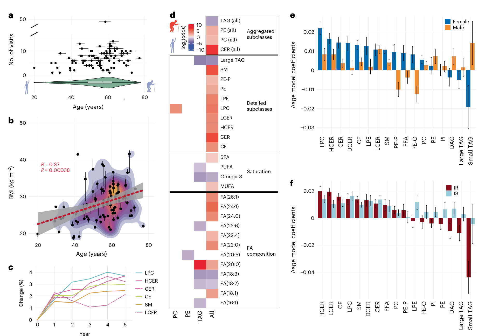
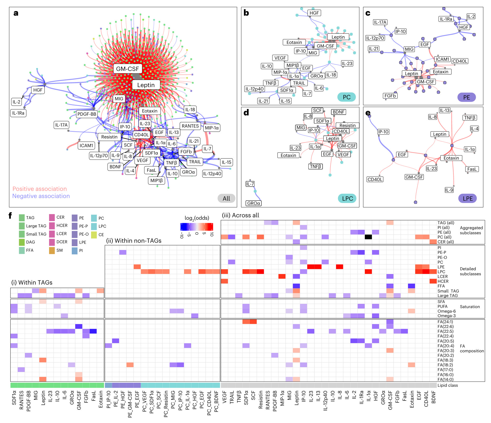

> 分享一篇文章。是最近刚发表的.

https://doi.org/10.1038/s42255-023-00880-1

# 简介

人体内存在两大类脂质:内源性脂质和外源性脂质。它们参与了细胞结构的维持、能量管理和细胞信号转导等多种生物学功能。然而,由于脂质的化学多样性,脂质组至今仍然是一个难以完全理解的复杂系统。

斯坦福大学Snyder实验室采用了定量脂质组学技术,对112名志愿者9年内共1539份血浆样本进行了纵向脂质组学检测。样本收集频率从每3个月1次,在患病期间增加至每周3-7次。他们不仅检测了800多个脂质物种,更重要的是研究了这些脂质同时测定的细胞因子和代谢指标之间的动态关联,揭示了脂质在健康与疾病过渡中的作用。

脂质是构成代谢组的一个重要且高度多样的分子家族,由于其广泛的理化性质及较少的脂质组学研究数量,脂质一直是难以完全认识的。 

复杂脂质可细分为几个类别和亚类别,它们通过脂质头基团和连接不同脂肪酰基链而区分。例如甘油三酰脂(TAG)、二酰甘油(DAG)、磷脂酰胆碱(PC)、磷脂酰乙醇胺(PE)、神经酰胺(CER)、鞘氨醇(SM)和胆固醇酯(CE),每个都由特定的骨架结构连接不同的脂肪酸(FA)组成。连接的FA可在不饱和键数目和部位上有所不同;FA与骨架一起赋予脂质独特的理化性质和生理功能。脂质参与并调节许多关键功能,包括氧化还原稳态、能量储存、胞内和胞外信号转导、诱导和解决炎症等。 

尽管脂质在维持人体稳态中发挥着关键作用,但不同脂质种类或类别对诱发急性炎症(如呼吸道病毒感染)的扰动响应各异,并在与慢性炎症相关的代谢性疾病(如2型糖尿病)和生理过程(如衰老)调节中可能发挥作用。鉴于脂质的多样作用,深入理解脂质在个体间的定量差异及其在不同表型中的动态变化,对特征化其在健康和疾病中的潜在作用至关重要。

在此,我们采用允许快速、定量和严格测定广泛脂质类型的质谱法,研究了100多名志愿者最长9年的血浆脂质组动态变化,覆盖了他们的健康和疾病时期。我们确定脂质档案与微生物组、衰老及不同临床病理生理学(包括胰岛素耐受和慢性与急性炎症)之间存在显著关联。我们的结果为人类不同代谢健康状态中的关键脂质和脂质亚类之间的关联提供了宝贵的见解,并为科学界提供了一个独特的资源。

# 研究内容

## 纵向深度脂质组检测

从一个胰岛素敏感和胰岛素耐受的队列中,我们之前收集了超过1000个不同时间点的纵向分子数据,包括基因组、转录组、蛋白组、代谢组和16S微生物组数据。在此队列中,我们在健康和疾病时期研究了各种分子特征,并确定了与代谢、心血管和肿瘤病理生理学相关的数百条分子通路。在这里,我们研究了一个在很大程度上未被探索的分子层——“血浆脂质组”,并将纵向跟踪时间延长了2年,以获得总共1539个样本。 

为了研究与健康状态和生活方式改变相关的脂质组变化,对112名参与者的血浆样本进行了脂质组分析,中位数为10个时间点,跨越2-9年(平均3.2年)。当参与者健康时,样本每3个月收集一次;在患病期间,收集频率增加到每周3-7次。除脂质检测外,我们还在每个取样时间点收集了50项临床实验室指标以及医疗记录。最后,由于样本是在压力和疾病期间收集的,我们还检测了62种细胞因子、趋化因子和生长因子。

采用高通量定量脂质组学流程进行人体脂质组特征化。该流程包含串联三重四极杆质谱仪和差分迁移率分离装置,能识别和稳健定量超过1000种跨16个亚类的脂质种类。我们观察到跨4个数量级的丰度分布,每个脂质亚类有明显的中位数和动态范围。甘油三酰脂和鞘氨醇的变异程度最小但丰度最高,而其它种类如LPC和CE则动态范围更大。

我们证实该技术具有高重现性。与生物样本相比,104个质控样本聚类明显不同;质控样本的中值系数变异(CV)较低(6.5-20.7%)。为确保分析的可靠性,我们关注736种脂质,其中质控CV < 20%,且生物样本CV大于质控CV。除游离脂肪酸外,所有类别的个体内变异均明显低于个体间变异,表明个体脂质特征在几个月到几年的时间尺度上是稳定的。

## 健康基线脂质组高度个体特异性

我们首先通过对96名参与者贡献的802份“健康”基线样本进行脂质组成分析,来研究个体间的脂质丰度差异。对于贡献了10次以上健康样本的11名参与者,我们进行了t-SNE分析,基于最个性化的100种脂质。样本主要根据个体进行聚类,说明一些脂质即使在多年内也能形成个体化的特征。

我们进一步使用WGCNA,根据健康基线样本中的脂质相似性将其分为7个模块,并与50项临床指标进行关联分析。我们观察到M1和M5(富集胆固醇酯和神经酰胺以及大中小甘油三酰脂)与2型糖尿病(高血糖、胰岛素)和炎症(C反应蛋白、白细胞)呈正相关,与HDL胆固醇呈负相关。M7含有一些游离脂肪酸和LPC,与更低的C反应蛋白和血糖相关。M3富集含醚键的PE,与更高的HDL和更低的胰岛素相关,代表更健康的特征。

此外,脂质与微生物组之间也存在负相关。这些微生物对胰岛素敏感个体更丰富,提示与宿主脂质代谢有益的关系。最后,我们还通过异常值分析鉴定了与潜在疾病(如脂肪肝)相关的异常高或低的脂质表达模式。总体而言,这些结果表明许多脂质亚类与健康状态相关,可作为生物标志物用于评估健康。

## 胰岛素耐受个体的全局脂质组异常

由于许多临床指标与特定脂质亚类相关,我们进一步研究了慢性代谢疾病胰岛素耐受如何影响脂质组。胰岛素耐受通常出现在2型糖尿病中,肌细胞和脂肪细胞对胰岛素反应迟钝,导致血糖升高。它常与慢性炎症以及代谢综合征相关,包括脂质异常,并可能导致非酒精性脂肪肝。阐明胰岛素耐受中脂质网络的扰动对了解代谢紊乱的分子机制和预后非常重要。 

通过稳态血浆葡萄糖水平可诊断胰岛素敏感/耐受。我们对69名参与者进行了测定,其中36名和33名被归类为胰岛素耐受和敏感。通过回归分析(控制年龄、性别、种族和基线BMI),我们观察到跨大多数脂质亚类,424种脂质与稳态血浆葡萄糖水平显著相关。与胰岛素敏感组相比,胰岛素耐受组甘油三酰脂、二酰甘油、神经酰胺增加,这与我们之前的癫痫和文献报道一致,也支持这些脂质用于区分胰岛素耐受/敏感。此外,我们新发现含醚键的PE(PE-P)与更低稳态血浆葡萄糖相关。PE-P参与细胞信号转导和抗氧化,提示与胰岛素耐受相关的炎症及PE介导的氧化应激之间可能存在联系。

我们还研究了胰岛素耐受/敏感状态如何影响脂质与临床指标之间的关联。我们观察到显著的效应大小差异和相关方向差异,涉及代谢、免疫和血液等方面。例如,在胰岛素耐受组LDL/HDL比率与PE-P/PE-O和LPE呈相反的相关。总体而言,这表明根据胰岛素耐受/敏感状态,脂质与临床指标之间的关联可能发生显著变化,参与能量调节、细胞信号转导和免疫稳态的关键脂质在胰岛素耐受中存在广泛紊乱。

## 呼吸道病毒感染期间的动态脂质组变化 

除了在慢性炎症和代谢条件(如胰岛素耐受)中的作用外,复杂脂质也是急性炎症反应的关键介质,例如通过释放花生四烯酸。因此,在呼吸道病毒感染和可能的疫苗接种过程中,复杂脂质可能会发生改变、释放和激活,并可能以与胰岛素耐受相关的方式参与这些过程。

36名参与者在72次不同的呼吸道病毒感染过程中和24名参与者在44次疫苗接种后进行了密集采样。我们将长期收集的样本分为急性期(1-6天)、后期(7-14天)和恢复期(3-5周)。通过线性模型,我们确定210种脂质在呼吸道病毒感染期间显著改变,包括甘油三酰脂、磷脂、鞘氨醇和LPC等。代表急性感染所需的能量转移,小分子甘油三酰脂和游离脂肪酸在早期快速减少后迅速恢复。含醚键的PE和LPC在早中期减少可能增加炎症状态和/或被用于清除自由基。这表明不同的关键脂质亚类在病毒生物学和免疫应答中可能发挥重要作用,并在呼吸道病毒感染过程中发生显著变化。

我们还比较了胰岛素敏感和耐受组在感染和疫苗接种后的反应。胰岛素耐受组在感染早期观察到更高的几种游离脂肪酸,而中后期磷脂胆碱则升高。这可能反映了能量代谢的改变和免疫相关信号通路变化。总体而言,我们的数据表明,区分脂质亚类及其组分对理解人体对急性炎症的响应至关重要。

## 胰岛素耐受个体的衰老改变

随着年龄增长,心血管疾病风险增加,常伴有2型糖尿病等疾病出现,以及慢性炎症状态。本研究的参与者年龄跨度20-79岁,平均被跟踪了3年。随着年龄增长,我们观察到BMI增加。通过线性模型估计脂质随年龄变化的效应,我们确定随着年龄增长,胆固醇酯、神经酰胺、鞘氨醇、LPC等脂质子类水平增加,代表可能与年龄相关的慢性低度炎症。与此同时,多不饱和脂肪酸、花生四烯酸和二十碳五烯酸下降。这与癫痫、心血管疾病风险增加一致。

此外,我们研究了胰岛素耐受如何改变分子衰老特征,发现胰岛素耐受组的神经酰胺、鞘氨醇和胆固醇酯的年龄相关变化更大,提示这些脂质与衰老加速相关。胰岛素耐受和敏感组间,我们还观察到磷脂在衰老中的变化方向不同。总之,我们的数据表明,脂质组成(不饱和度、omega-3脂肪酸、大分子甘油三酰脂、含醚键磷脂等)随年龄变化显著,这一过程在性别间存在差异,并在胰岛素耐受存在时加速。

## 脂质与细胞因子的特异性关联

最后,鉴于细胞因子、趋化因子和生长因子在各种生物过程中的重要性,我们研究了它们在平衡状态和各种病理过程中与脂质的关系。我们发现40种细胞因子中的大多数与580种脂质存在1245个正相关或负相关的关联。

例如,我们观察到粒细胞-巨噬细胞集落刺激因子和瘦素与许多甘油三酰脂呈强正相关。这与这些脂质的潜在促炎作用一致。另一方面,IL-6和IL-10等具有免疫调节作用的细胞因子则与部分甘油三酰脂呈负相关。这表明不同甘油三酰脂种类在免疫调控网络中可能发挥不同功能。此外,我们还观察到lysophosphatidylcholine(LPC)与多种生长因子和促炎因子呈正相关,同时与C反应蛋白等标志呈负相关。这提示LPC可能具有免疫激活和免疫抑制双重功能。总体而言,我们的多组学数据描绘了细胞因子和脂质亚类之间的复杂关联,以及不同脂肪酰基组成的脂质与特定细胞因子的差异关联,提示其在免疫激活与免疫抑制中的不同作用。

# 意义
  
- 该研究建立了人体脂质组与健康、疾病及衰老过程之间的动态联系,为脂质在人体生理病理过程中的多重作用提供了全新的视角。

- 不同脂质种类及其组分的独特模式为开发新的生物标志物、研究疾病机制以及设计个体化干预提供了基础。

- 结果提示,通过饮食等途径针对性改变外源性脂质的摄入或靶向关键脂质转换酶有望成为减轻慢性炎症、改善代谢健康的新策略。

本研究采用先进的脂质组学技术对人群进行长时间跟踪,揭示了脂质网络在健康和疾病中的多样性角色,为开发新的个体化医疗提供了宝贵资源。我们有理由相信,继续深入解析脂质-健康关系,将大大推动未来医学的发展。

